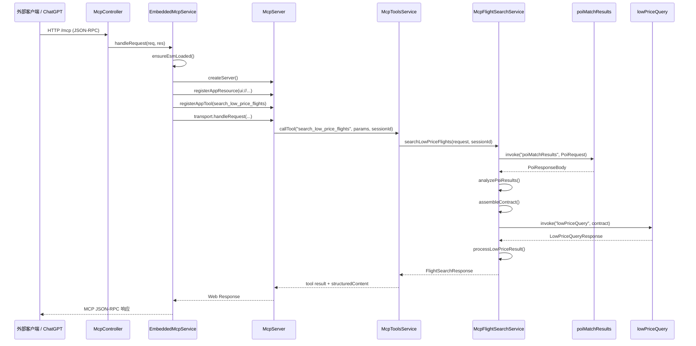

Server 端：
`main/modules/mcp` 本质上是一个“把内部低价航班查询能力包装成 MCP Server”的 NestJS 模块。按当前实现，它同时暴露了两条入口：
1. 标准 MCP JSON-RPC 入口 /mcp，给外部 MCP Client 或 ChatGPT Apps 调用，由 mcp.controller.ts (line 11) 转发到 embedded-mcp.service.ts (line 55)。
2. 内部直调入口 /internal/mcp/flight-search，给本系统内部直接调用，由 mcpFlightSearch.controller.ts (line 8) 直接调用 mcpFlightSearch.service.ts (line 19)。

无论走哪条入口，最后真正执行业务的都是 McpFlightSearchService。它的核心流程是：  
请求入参 -> POI 匹配 -> 组装 lowPriceQuery 请求 -> 调用 SOA -> 转成 MCP/内部统一返回格式。

这个模块被主应用在 app.module.ts (line 40) 中引入，说明它是应用正式启动的一部分。

**调用链**  
/mcp 的链路是：  
McpController.handleMcpRequest -> EmbeddedMcpService.handleRequest -> 动态创建 McpServer -> 注册 UI 资源和工具 search_low_price_flights -> 工具回调里调用 McpToolsService.callTool -> McpFlightSearchService.searchLowPriceFlights。

/internal/mcp/flight-search 的链路更短：  
McpFlightSearchController.searchLowPriceFlights -> McpFlightSearchService.searchLowPriceFlights -> 返回结果再包装成 SoaResponse。

时序图
